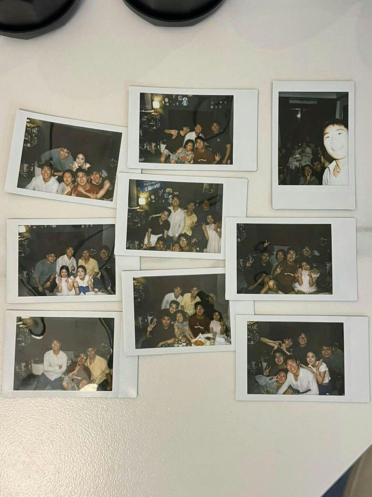

# 生活

这周主要是朋友来上海，大家一起玩，也发生了一些事。

对自我的审视，或者说和别人聊天时所说的，都是觉得在lx来上海的机场没有回她，是一件非常冷漠我做错的事。其他之外好像都还好。包括之后zhd说希望大家不要给她压力，我觉得fine，我能理解，你从你的视角出发，觉得别人是在做理中客，但是每个人都有每个人的立场，所以我能理解你。我也能理解你不理解我，但是我觉得你做错了，你也不要觉得你不能理解我对你产生这个想法。说的比较复杂，所以这件事之后，我也会开始重新审视一些关系，虽然可能之前已经足够明确，我的想法还是只有自己会陪着自己，所以一切的都可以过去，包括我的忍受阈值确实会更高。

这件事过去了，剩下的都是大家一起玩的时候，认识了一个新的男生。我不太确定我对他的感觉，是来源于真的喜欢，还是因为好像觉得自己需要谈恋爱了而产生的心情。我分不清，所以这应该就不是爱情吧。

在zd走了之后，还有一些些的难过，因为他是一个好人。虽然他也没有那么好，或者说谁也不能成为我很好的朋友，我们俩的关系也没有那么密切。但是我觉得客观来说，或者说我主观来说，他是个好人，其他人都有自己的小心思，他的小心思虽然也有，但是写在脸上，而且不坏。

其实我觉得gx也挺好的，他更加清晰的能够面对自己的一些外人可能看来错，他觉得对的想法，我觉得挺好的。真实自己，或者说接纳自己，是我们现在必须要学会，并且正在学习的事。

至于有些人，我觉得我不太理解，我也不想理解，我也不想再牺牲自己。但是我阈值比较高，所以可以忍耐，但是要思考。

之后来家里做客的朋友都要一起拍一些大合照，我觉得需要记录，照片定格的瞬间好像就是永恒了吧？我觉得挺弥足珍贵的，无论之后会怎么样。

# 工作

又送走一个实习生。

又要开始无意义的联调，接下来应该会开始忙一点吧。

但整体的工作内容还是比较轻松的，只是越来越意识到要慢慢提升自己了，感觉一直躺在舒适圈里，肯定会退步（我们东亚小孩就这样想吧）。

# 心情

好想谈恋爱

